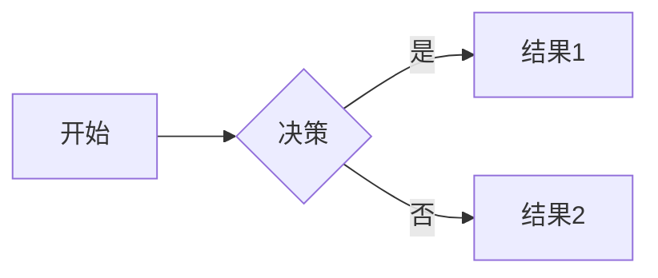

# 最大标题

## 次级标题

### 第三级标题

... 以此类推

### 斜体

*这段文字会显示为斜体*

### 粗体

**这段文字会显示为粗体**

### 删除线

~~这段文字会显示为删除线~~

### 无序列表

- 列表项一
- 列表项二
  - 子列表项一
  - 子列表项二

- 第二个列表项

- 第三个列表项

### 有序列表

1. 第一项
2. 第二项
3. 第三项

### 链接

[点击这里访问Google](https://www.google.com)

### 脚本

`alert("Hello World!");`

### 代码块

```javascript
function example() {
  console.log("这是一个代码块示例");
}
```

### 引用

> 这是一段引用文本
> 可以包含多行
>
> 第二段引用文本

### 表格

| 标题1 | 标题2 | 标题3 |
|-------|-------|-------|
| 单元格1 | 单元格2 | 单元格3 |
| 单元格4 | 单元格5 | 单元格6 |

### 表格2

| 左对齐 | 居中  | 右对齐 |
| :------ | :---: | ------: |
| 单元格123  | 单元格123 |  单元格123 |
| 单元格  | 单元格 |  单元格 |

### 转义

\*这不是斜体\*

### 分割线

---

### 内嵌HTML

<div>这是一个div元素</div>
<span>这是一个span元素</span>

### 图片

[这是一个链接](https://www.example.com "链接标题")


### 脚注

这是一个脚注的例子[^1]

[^1]: 这是脚注的内容。

### 定义

项目1
:   定义1

项目2
:   定义2

### 流程图



### 高亮

==这段文本将被高亮==



### 在指定路径下新建文章

```shell
hexo n -p post dir/post1
```
